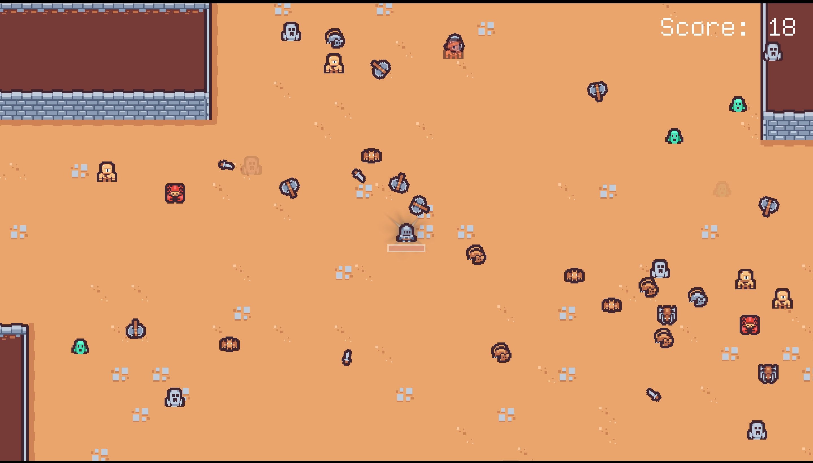

# Tiny Micro Survivor

A tiny micro game where the player wanders around, trying to avoid a constant
stream of pursuing mobs.

- Score is based on how long the player survives
- Health is shown beneath the player and slowly replenishes over time

## Libraries and assets

This game is made with the [orx game engine](https://orx-project.org) and uses
assets from [Kenney](https://kenney.nl).

## Licenses

### Game

This game is distributed under the [zlib license](LICENSE), the same license as
orx.
